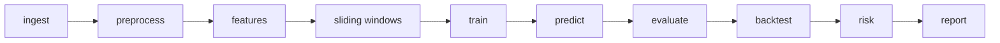
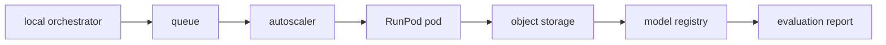
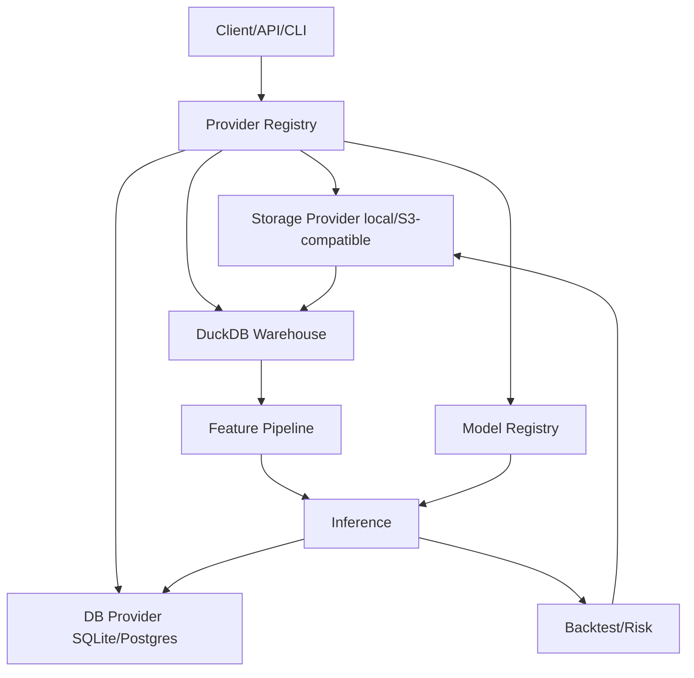
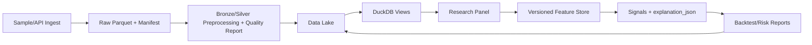
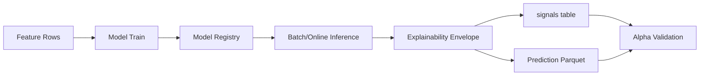

# Public Source Monitor

A small Django project for collecting public news, trends, papers, security
advisories, and other open-web data from RSS feeds, HTML pages, sitemaps, and
approved APIs.

The ingestion flow stores raw snapshots first, normalizes parsed records second,
and exports analytical datasets to Apache Arrow / Parquet. SQLite holds source
metadata, checkpoints, job status, review queues, and the normalized browse
index.

## Quant ML Pipeline MVP

The quant ML pipeline is local-first, budget-first, and provider-neutral. SQLite,
local filesystem storage, DuckDB, local queues, local model cache, and CPU
execution remain the default. Postgres, S3-compatible object storage, Redis, and
RunPod GPU jobs are optional runtime choices selected through settings and
`ProviderRegistry`.

### Pipeline Architecture





### Local MVP

Run the dependency-light CLI flow with no paid services:

```bash
python3 -m src.cli ingest run --config configs/ingest_sample.yaml
python3 -m src.cli preprocess run --config configs/preprocess_mvp.yaml
python3 -m src.cli features build --config configs/features_mvp.yaml
python3 -m src.cli windows build --config configs/sliding_window_mvp.yaml
python3 -m src.cli train run --config configs/train_baseline.yaml
python3 -m src.cli evaluate run --config configs/evaluate_mvp.yaml
```

Run the orchestrated local pipeline:

```bash
python3 -m src.cli pipeline dry-run --config configs/pipeline_local_mvp.yaml
python3 -m src.cli pipeline run --config configs/pipeline_local_mvp.yaml
```

Docker local mode is optional:

```bash
make local-up
make smoke-test
make local-down
```

See [Local MVP runbook](docs/runbooks/local_mvp.md) for the complete local path.

### RunPod Dry Run

RunPod is dry-run by default and does not launch paid infrastructure:

```bash
make runpod-dry-run
python3 -m src.cli compute runpod dry-run --config configs/train_gpu_runpod.yaml
```

Expected dry-run output includes `status: PLANNED`, `dry_run: true`, and
`launches_paid_infrastructure: false`.

### Real RunPod Submit

Real hourly GPU submission requires explicit cost confirmation, runtime secrets,
remote artifact URIs, and `RUNPOD_DRY_RUN=false`:

```bash
RUNPOD_DRY_RUN=false \
RUNPOD_API_KEY=... \
python3 -m src.cli compute runpod submit --config configs/train_gpu_runpod.yaml --confirm-cost
```

The GPU image build command is documented and available at the repo root:

```bash
docker build -f Dockerfile.gpu -t ghcr.io/pedroramos17/data-analysis:latest .
```

See [RunPod secure hourly jobs](docs/cloud/runpod_secure_hourly.md) and
[GPU training RunPod runbook](docs/runbooks/gpu_training_runpod.md).

### Cost Guard

Cost minimization chooses the cheapest safe plan across local CPU, local smoke,
RunPod GPU, and batched RunPod GPU options. Paid jobs are blocked unless the
budget guard allows them and `--confirm-cost` is present.

```bash
make cost-estimate
python3 -m src.cli cost estimate --config configs/pipeline_local_mvp.yaml
python3 -m src.cli cost plan --config configs/train_gpu_runpod.yaml --confirm-cost
```

Default examples keep `dry_run_default: true`, require confirmation for paid
jobs, and cap job/daily costs in `configs/cost_limits.yaml`. See
[Cost minimization](docs/cost/cost_minimization.md).

### Rate Limits

Rate limiting is enabled through dependency-light policy code. Memory rate
limits are default; Redis is optional. GPU submit has stricter hourly and daily
limits than read-only or health endpoints.

```bash
configs/rate_limits.yaml
```

Heavy/write API endpoints require API key auth when auth is enabled. See
[Rate limits](docs/security/rate_limits.md).

### Efficiency Reports

Pipeline runs write efficiency JSON/Markdown reports and append metrics to JSONL:

```bash
python3 -m src.cli efficiency report --run-id 1
make efficiency-report RUN_ID=1
```

Reports include task count, wall time, CPU time, peak memory, row throughput,
estimated cloud cost, quality gates, and recommendations. See
[Code efficiency observability](docs/observability/code_efficiency.md).

### SQLite And Cloud Mode

SQLite remains available in every mode by setting `DB_MODE=sqlite` and
`SQLITE_PATH`. This is the default for local, offline, edge, and test workflows.

Postgres/cloud mode is selected with `DB_MODE=postgres` and `DATABASE_URL` or the
`POSTGRES_*` environment variables. Object storage is selected with
`STORAGE_PROVIDER=minio|s3|r2|b2` and S3-compatible bucket/endpoint credentials.
Redis is optional through `QUEUE_PROVIDER=redis` or `RATE_LIMIT_PROVIDER=redis`.

Cloud MVP runs on a cheap VPS with app, optional container Postgres, optional
MinIO, optional Redis, and RunPod only for external GPU jobs. See
[Cheapest cloud MVP deployment](docs/deployment_mvp.md) and
[Autoscaling](docs/cloud/autoscaling.md).

### Pipeline Documentation

- [Ingestion](docs/pipeline/ingestion.md)
- [Preprocessing](docs/pipeline/preprocessing.md)
- [Features](docs/pipeline/features.md)
- [Sliding windows](docs/pipeline/sliding_windows.md)
- [Training](docs/pipeline/training.md)
- [Evaluation](docs/pipeline/evaluation.md)
- [RunPod secure hourly jobs](docs/cloud/runpod_secure_hourly.md)
- [Autoscaling](docs/cloud/autoscaling.md)
- [Rate limits](docs/security/rate_limits.md)
- [Cost minimization](docs/cost/cost_minimization.md)
- [Code efficiency observability](docs/observability/code_efficiency.md)
- [Local MVP runbook](docs/runbooks/local_mvp.md)
- [GPU training RunPod runbook](docs/runbooks/gpu_training_runpod.md)
- [Final acceptance checklist](docs/final_acceptance.md)

## Hybrid Quant MVP Quickstart

The Quant MVP is local-first and provider-neutral. Local development uses SQLite,
local filesystem storage, DuckDB, local model cache, and local/planned compute by
default. Cloud MVP mode can switch the same API/CLI code to Postgres and
S3-compatible object storage through environment variables.

### Local Setup

```powershell
python -m venv .venv
.\.venv\Scripts\Activate.ps1
python -m pip install -r requirements.txt
python manage.py migrate
python -m src.cli db migrate
python -m src.cli config show
```

On Linux/macOS, activate with `source .venv/bin/activate`.

### Cloud MVP Setup

```powershell
cp .env.cloud.example .env.cloud
# edit secrets, allowed hosts, storage endpoint, and budget values
CLOUD_ENV_FILE=.env.cloud make cloud-mvp-up
CLOUD_ENV_FILE=.env.cloud make migrate
```

The cloud MVP compose stack targets one cheap VPS/free-tier VM with app,
Postgres, optional MinIO, optional Redis, and optional scheduler profiles.

### Full MVP Command

```powershell
python -m src.cli mvp-demo --config configs/cloud_mvp.yaml
```

Equivalent Make target:

```powershell
make mvp-demo
```

### Key Environment Variables

| Variable | Local default | Cloud MVP use |
| --- | --- | --- |
| `APP_ENV` | `local` | `cloud` |
| `DEPLOYMENT_MODE` | `onprem` | `cloud_mvp` |
| `DB_MODE` | `sqlite` | `postgres` |
| `SQLITE_PATH` | `./db.sqlite3` | fallback only |
| `DATABASE_URL` | empty | Postgres connection URL |
| `STORAGE_PROVIDER` | `local` | `minio`, `s3`, `r2`, or `b2` |
| `DATA_LAKE_ROOT` | `./data/lake` | local cache/mount path |
| `OBJECT_STORAGE_BUCKET` | empty | object-store bucket |
| `OBJECT_STORAGE_ENDPOINT_URL` | empty | MinIO/R2/B2 endpoint |
| `OBJECT_STORAGE_ACCESS_KEY_ID` | empty | object-store access key |
| `OBJECT_STORAGE_SECRET_ACCESS_KEY` | empty | object-store secret key |
| `OLAP_MODE` | `duckdb` | `duckdb` |
| `DUCKDB_PATH` | `./data/lake/analytics.duckdb` | DuckDB cache path |
| `MODEL_PROVIDER` | `local` | `local`, `s3`, `r2`, or future `huggingface` |
| `MODEL_CACHE_DIR` | `./models` | mounted model cache |
| `QUEUE_PROVIDER` | `local` | `local` or optional `redis` |
| `COMPUTE_PROVIDER` | `local` | `local`, `runpod`, `colab`, `vastai`, or `stub` |
| `ORCHESTRATOR` | `local` | optional `apscheduler`, `prefect`, or `dagster` settings boundary |
| `RATE_LIMIT_PROVIDER` | `memory` | optional `redis` |
| `MODEL_DEVICE` | `cpu` | `cpu`, `cuda`, or `auto` for explicit model jobs |
| `COST_MODE` | `minimum` | `minimum`, `balanced`, or `performance` |
| `CLOUD_MONTHLY_BUDGET_USD` | `25.00` | monthly guardrail |
| `CLOUD_MAX_JOB_COST_USD` | `2.50` | per-job guardrail |
| `CLOUD_REQUIRE_BUDGET_APPROVAL` | `true` | approval guard |

Cloud connectivity tests are disabled by default and only run when
`ENABLE_CLOUD_TESTS=true` is explicitly set.

### Provider Matrix

| Boundary | Local default | Cloud MVP option | Notes |
| --- | --- | --- | --- |
| Database | SQLite | Postgres | Django migrations remain authoritative; SQLAlchemy compatibility schema is additive |
| Storage | local filesystem | S3-compatible S3/R2/B2/MinIO | business logic uses storage facade, not SDK imports |
| Warehouse | DuckDB local Parquet | DuckDB over mirrored object-store cache | DuckDB file is rebuildable |
| Queue | local/planned | optional Redis | heavy jobs plan/queue by default |
| Rate limit | in-memory | optional Redis | Redis requires explicit `RATE_LIMIT_REDIS_URL` or `REDIS_URL` |
| Secrets | env | env or future provider boundary | do not commit secrets |
| Model registry | local cache | object-store provider | pretrained adapters use local checkpoints |
| Compute | local synchronous/planned | RunPod dry-run or batch stubs | no managed GPU requirement for local mode |

Provider contracts stay behind `ProviderRegistry`. Compute providers expose
submission, status, logs, cancellation, idle termination, cost estimates, and
health checks. Storage providers expose byte and file transfer methods. Queue
providers expose publish/consume plus ack, retry, and dead-letter controls.

### GPU Job Dry Run

Generate a RunPod-style GPU job manifest without launching paid infrastructure:

```powershell
make gpu-job-dry-run
```

The target forces `RUNPOD_DRY_RUN=true`, `DB_MODE=sqlite`, `STORAGE_PROVIDER=local`,
and `QUEUE_PROVIDER=local` so it requires no cloud credentials.

### Architecture Diagram



### Data Flow Diagram



### Model Flow Diagram



### Documentation Map

- [Cloud facade architecture](docs/architecture/cloud_facade.md)
- [Database modes](docs/architecture/database_modes.md)
- [Data lake and DuckDB](docs/architecture/data_lake_duckdb.md)
- [Model registry](docs/architecture/model_registry.md)
- [Cheap cloud MVP](docs/architecture/cheap_cloud_mvp.md)
- [Budget-first architecture rules](docs/architecture/budget_first_rules.md)
- [Current pipeline audit](docs/audit/current_pipeline_map.md)
- [Cloud pipeline gaps](docs/audit/gaps_for_cloud_pipeline.md)
- [Ingestion pipeline](docs/ingestion_pipeline.md)
- [Preprocessing pipeline](docs/preprocessing_pipeline.md)
- [Feature pipeline](docs/feature_pipeline.md)
- [Final deliverables](docs/final_deliverables.md)
- [Fin-Mamba](docs/models/fin_mamba.md)
- [SAMBA](docs/models/samba.md)
- [Local mode runbook](docs/runbooks/local_mode.md)
- [Cloud MVP runbook](docs/runbooks/cloud_mvp_mode.md)
- [Recovery runbook](docs/runbooks/recovery.md)
- [Budget plan](docs/cost/budget_plan.md)

## Setup

```powershell
python -m venv .venv
.\\.venv\\Scripts\\Activate.ps1
python -m pip install -r requirements.txt
python -m playwright install chromium
python manage.py migrate
python manage.py load_worldmonitor_feeds
python manage.py seed_dev_admin --show-credentials
python manage.py runserver 127.0.0.1:8000 --noreload
```

The optional Quant MVP database compatibility schema is managed by Alembic:

```powershell
alembic -c alembic.ini upgrade head
```

See [Database compatibility](docs/database_compatibility.md) for the SQLite and
Postgres paths.

Build a DuckDB research panel over local Parquet with:

```powershell
python -m src.cli warehouse build-panel --config configs/panel.yaml
```

See [DuckDB warehouse](docs/duckdb_warehouse.md) for view and materialization
details.

Build versioned quant feature rows from DuckDB/Parquet with:

```powershell
python -m src.cli features build --config configs/features.yaml
```

See [Feature pipeline](docs/feature_pipeline.md) for feature groups and
metadata persistence.

Data lake and artifact writes should use the provider-neutral object storage
facade in `src.storage`; see [Object storage](docs/object_storage.md).

Forecast models use the stable `BaseForecastModel` interface, CPU-first
baselines, and optional pretrained adapters; see
[Pre-trained model layer](docs/model_layer.md).

Provider choices for database, storage, warehouse, queue, rate limiting, secrets,
model registry, and compute are loaded through `src.config.settings` and resolved
by `src.providers.build_provider_registry()`. Quant4 experiment provenance
records non-secret provider metadata under `provenance_json["providers"]`.

Start the provider-neutral API facade with:

```powershell
uvicorn src.api.main:app --host 0.0.0.0 --port 8001
```

OpenAPI docs are available at `/docs`; see [API facade](docs/api_facade.md).

Core MVP workflows can also run without the API server through
`python -m src.cli`; see [CLI commands](docs/cli.md).

Run the cheapest cloud MVP on Docker Compose without Kubernetes:

```powershell
make local-up
make migrate
make smoke-test
```

See [Cheapest cloud MVP deployment](docs/deployment_mvp.md) for local and
single-VPS cloud commands.

## Development Admin User

For local development, create a Django admin user with an idempotent seed:

```powershell
python3 manage.py migrate
python3 manage.py seed_dev_admin --show-credentials
```

If `DEV_ADMIN_PASSWORD` is not set while `DEBUG=True`, the command generates a
one-time local password and prints it with `--show-credentials`:

```text
URL: http://127.0.0.1:8000/admin/
username: admin
password: <printed by seed_dev_admin>
```

Override credentials with `DEV_ADMIN_USERNAME`, `DEV_ADMIN_EMAIL`, and
`DEV_ADMIN_PASSWORD`, or pass `--username`, `--email`, and `--password`. The
command refuses non-debug environments unless `--allow-production` is passed,
and production mode never accepts generated development passwords.

The older `create_admin_user` command remains available for deployments that
already use `MONITOR_ADMIN_*` variables.

## Common Commands

```powershell
python manage.py test
python manage.py load_worldmonitor_feeds
python manage.py add_google_news_topic --query "AI chips" --category technology --tags ai,chips
python manage.py ingest_due_sources --limit 20
python manage.py ingest_source --source-id 1 --limit 50
python manage.py build_daily_digest
python manage.py enrich_documents --limit 500
python manage.py discover_sources --limit 200
python manage.py evaluate_alerts --lookback-hours 24
python manage.py cluster_topics --window-hours 72 --min-documents 3
python manage.py score_source_reputation --window-days 30
python manage.py export_parquet --output exports\\documents.parquet
python manage.py inspect_compute --profile local_cpu_low
python manage.py create_dashboard_jobs --template local_simple_pipeline --profile local_cpu_low
python manage.py dashboard_worker --profile local_cpu_low --worker-id cpu-1
```

## Comparison Machine Philosophy

Sourceflow is a comparison machine, not a truth machine. It does not decide
which article is true, label sources as biased, or infer hidden intent. Its job
is to make differences in coverage visible, measurable, and explainable.

The comparison pipeline groups feeds under providers and owners, clusters
articles into event groups, extracts local entity and claim candidates, and
compares coverage across sources, providers, and owners. Omission detection is
comparative: it can say that a provider covered an event but did not mention a
claim or entity that appeared in comparable coverage. It should not say that a
provider hid the truth.

Local deterministic backends are the default so the MVP can run on SQLite and
Parquet without heavy infrastructure:

```powershell
python manage.py ingest_rss --limit 50
python manage.py enrich_articles --limit 500
python manage.py cluster_events --window-hours 72
python manage.py compare_events --limit 100
python manage.py export_parquet --dataset all --output-dir exports
```

The first Parquet datasets for analytical workloads are `articles`, `entities`,
`claims`, `events`, `article_event_links`, `event_coverage`, and
`event_comparison_snapshots`.

## Compute Profiles

The project separates safe local work from advanced GPU/cloud work. Use
`local_cpu_low` for weak notebooks, `local_mx350_queue` only for micro-batch
GPU smoke tests, `local_rtx4060ti` for strong local GPU runs, and
`cloud_student` or `cloud_serverless_on_demand` for large partitioned jobs.

See:

- [Compute profiles](docs/compute_profiles.md)
- [Low-end local setup](docs/local_low_end_setup.md)
- [Cloud student setup](docs/cloud_student_setup.md)
- [Control dashboard](docs/control_dashboard.md)

## Control Dashboard

The multi-profile control dashboard is available at:

```text
http://127.0.0.1:8000/dashboard/
```

It manages SQLite-backed `PipelineJob` rows, local workers, resource locks,
resource snapshots, cloud budget policies, usage estimates, logs, manifests,
and generated artifacts. It does not require Celery, Redis, PyTorch, CuPy, or
cloud SDKs.

Start workers from separate terminals:

```powershell
python manage.py dashboard_worker --profile local_cpu_low --worker-id cpu-1
python manage.py dashboard_worker --profile local_mx350_queue --worker-id mx350-1
python manage.py dashboard_worker --profile local_rtx4060ti --worker-id gpu-1
```

Create jobs from safe templates:

```powershell
python manage.py create_dashboard_jobs --template local_simple_pipeline --profile local_cpu_low
python manage.py create_dashboard_jobs --template cloud_student_advanced_plan --profile cloud_student --dry-run
```

Cloud jobs are manifest-based and provider-neutral. They are blocked by a
budget policy and, by default, remain `waiting_approval` until explicitly
approved:

```powershell
python manage.py cloud_budget_summary
python manage.py approve_cloud_job --job-id 123 --approved-by local-admin
python manage.py block_cloud_job --job-id 123 --reason "over budget"
```

Operating concept: local CPU validates data and simple features; MX350 runs
only micro-batches; RTX accelerates bounded local GPU work; cloud profiles
scale partitioned advanced jobs with budget guards.

## CI/CD Patterns

GitHub Actions workflows live in `.github/workflows/`:

- `ci.yml` runs Django checks, migration drift checks, migrations, tests, and
  lightweight dashboard/compute smoke checks on pushes and pull requests.
- `release-preview.yml` is a manual `workflow_dispatch` preview that validates
  the project and uploads a small diagnostic artifact without deploying or
  running cloud jobs.

The workflows install only the lightweight core requirements. Provider SDKs,
PyTorch, CuPy, Celery, Redis, and cloud execution remain optional.

## Safety Boundaries

- The crawler checks `robots.txt` before HTTP or browser fetches.
- Browser fetches are limited to public pages that need JavaScript rendering.
- The project does not bypass logins, paywalls, anti-bot systems, or access
  controls.
- Retries use bounded exponential backoff, failed records go to a dead-letter
  table, and writes are idempotent through source-scoped and global hashes.
- RSS feeds load from `monitoring/catalogs/worldmonitor_feeds.json` and are
  validated against `monitoring/catalogs/rss_allowed_domains.json`.
- The digest API is available at `/api/news/v1/list-feed-digest/`; the browser
  digest page is `/digest/`.
- Phase 2 intelligence runs locally: enrichment, source discovery candidates,
  in-app alert rules, deterministic topic clusters, canonical URL references,
  and source reputation snapshots. Alert review is available at `/alerts/` and
  topic clusters are available at `/topics/`.

## Symbolic Factor Mining

Sourceflow includes a local Symbolic Factor Mining subsystem for source
intelligence comparison and propagation analysis. It stores typed formula
metadata, dependencies, evaluations, and run records in SQLite, while
materialized factor values remain Parquet-first under `exports/factors/`.
The subsystem avoids truth judgments and explains signals as coverage
asymmetry, provider concentration, framing divergence, evidence density, claim
disagreement, possible omission, and amplification patterns.

Example commands:

```powershell
python manage.py init_factor_base
python manage.py register_seed_factors
python manage.py compute_factors --as-of 2026-05-28T12:00:00Z
python manage.py search_symbolic_factors --method random --n 500 --max-depth 4 --objective future_event_growth --window 7d
python manage.py search_symbolic_factors --method gp --population 100 --generations 20 --objective future_claim_conflict --max-depth 5
python manage.py evaluate_factors --factor coverage_intensity --objective future_event_growth
python manage.py explain_factor_score --factor coverage_intensity --entity-id event:1
python manage.py build_graphrag_context --recent 100
```

Example formula JSON:

```json
{
  "kind": "binary",
  "name": "div_safe",
  "left": {"kind": "operand", "name": "article_count", "return_type": "numeric"},
  "right": {"kind": "constant", "value": 1.0, "return_type": "numeric"}
}
```

Example GraphRAG context output:

```json
{
  "event_id": 42,
  "event_title": "Example event",
  "top_sources": ["Source A", "Source B"],
  "top_providers": ["Provider A"],
  "top_factor_scores": [
    {
      "name": "coverage_intensity",
      "explanation": "Compares coverage by one source against peer coverage for the same event."
    }
  ]
}
```
