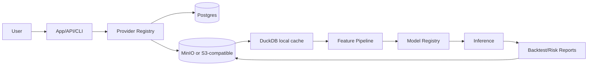

# Cheap Cloud MVP Architecture

The cheap cloud MVP targets one small VPS or free-tier VM. It avoids Kubernetes,
managed GPU, paid vector databases, Kafka, and live trading.

See [Budget-first architecture rules](budget_first_rules.md) for enforced MVP
constraints and future upgrade seams.

## Default Compose Stack

`docker-compose.cloud-mvp.yml` provides:

| Service | Default role |
| --- | --- |
| `app` | Django/API/CLI container with Gunicorn |
| `postgres` | Transactional metadata database |
| `minio` | Optional S3-compatible object storage profile |
| `redis` | Optional queue profile |
| `scheduler` | Optional simple ingest scheduler profile |

## Cloud MVP Flow



## Commands

```bash
cp .env.cloud.example .env.cloud
# edit secrets and allowed hosts
CLOUD_ENV_FILE=.env.cloud make cloud-mvp-up
CLOUD_ENV_FILE=.env.cloud make migrate
python -m src.cli smoke-test
python -m src.cli mvp-demo --config configs/cloud_mvp.yaml
```

## Budget Controls

Use these settings to keep cost visible:

```text
CLOUD_MONTHLY_BUDGET_USD=25.00
CLOUD_MAX_JOB_COST_USD=2.50
CLOUD_REQUIRE_BUDGET_APPROVAL=true
```

Connectivity tests that can contact external paid services must require
`ENABLE_CLOUD_TESTS=true`.
