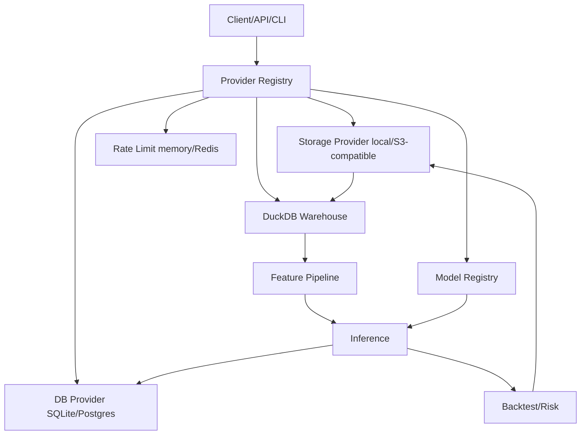

# Cloud Facade Architecture

The cloud facade keeps application code local/cloud-neutral. Runtime settings are
loaded once, then `src.providers.registry.ProviderRegistry` lazily resolves the
configured database, storage, warehouse, queue, secrets, model registry, and
compute providers. Rate limiting is also resolved through the same registry so
local single-process runs can use memory while shared workers can opt into Redis.

## Core Rule

Business logic should call provider interfaces and should not import cloud SDKs
directly. For example, data lake writes go through `DataLakeArtifactStore`, and
S3-compatible SDK usage is confined to `src.providers.storage.s3_compatible`.

## Local/Cloud-Neutral Architecture

## Provider Matrix

| Boundary | Local default | Cloud MVP option | Optional dependency |
| --- | --- | --- | --- |
| Database | SQLite | Postgres | `psycopg` for provider health/connectivity |
| Storage | local filesystem | S3-compatible S3/R2/B2/MinIO | `boto3` |
| Warehouse | DuckDB over local Parquet | DuckDB over mirrored object-store cache | `duckdb`, `pyarrow` |
| Queue | local in-memory/planned jobs | optional Redis | `redis` |
| Rate limit | in-memory fixed window | optional Redis fixed window | `redis` |
| Secrets | environment variables | env/aws/gcp/doppler boundary | provider SDK |
| Model registry | local model cache | object-store/Hugging Face boundary | `boto3` or future hub adapter |
| Compute | local synchronous/planned | RunPod dry-run, Colab/VastAI stubs | provider SDK only when implemented |

## Phase 2 Contracts

- Compute providers expose `submit_job`, `get_status`, `stream_logs`,
  `cancel_job`, `terminate_idle`, `estimate_cost`, and `healthcheck`.
- Storage providers expose `put_file` and `get_file` in addition to byte-level
  object operations.
- Queue providers expose `ack`, `retry`, and `dead_letter` in addition to
  `publish` and `consume`.
- Rate-limit providers expose `allow`, `reset`, and `healthcheck`.

## Safety

Cloud tests and cloud connectivity are opt-in. Tests that can contact external
Postgres or object storage must skip unless `ENABLE_CLOUD_TESTS=true` is set.
RunPod defaults to dry-run manifests and real launch paths require an explicit
API key plus future implementation behind the compute provider boundary.
