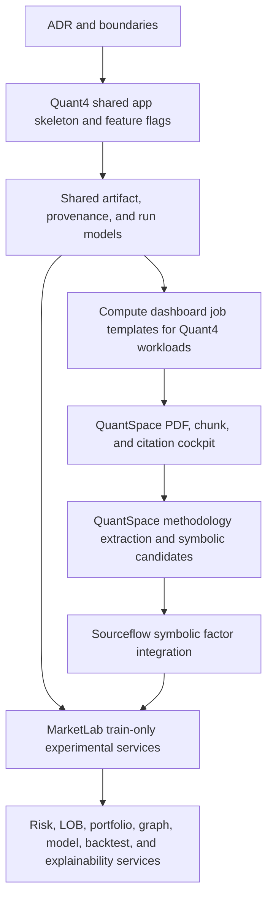

# Quant4 Architecture Binding ADR

Status: Proposed

Date: 2026-05-30

## Context

This project is a local-first Django research and intelligence system. Django is
the control plane, SQLite stores operational metadata, and Apache Arrow/Parquet
stores heavy analytical datasets and materialized feature matrices. DuckDB may
be used later for analytical queries over Parquet, but it is optional.

Sourceflow already provides the comparison-machine foundation:

- `monitoring` owns the Django UI, URLs, models, management commands, review
  queues, compute dashboard, and local job orchestration.
- `sourceflow` owns intelligence services, symbolic factor mining, finance
  research helpers, typed formula expressions, feature flags, and local
  analytical services.
- SQLite stores Sourceflow symbolic formula metadata, dependencies,
  evaluations, and run records through the factor registry.
- Parquet stores materialized factor values and exported analytical datasets.

Sourceflow is a comparison machine, not a truth machine. It must explain
coverage asymmetry, framing divergence, evidence density, claim disagreement,
possible omission, provider concentration, and propagation patterns without
claiming truth, intent, causality, profitability, or investment advice.

## Decision

Bind the next research system into four non-overlapping roles.

### Sourceflow

Sourceflow remains the intelligence, comparison, and symbolic factor mining
layer. It continues to own formula generation, formula validation, factor
evaluation, neutral explanations, and comparison-oriented GraphRAG context.

Sourceflow remains responsible for symbolic factor candidates that compare
observable research or market evidence. It does not become a portfolio manager,
live-trading system, profitability engine, or truth-verification system.

### QuantSpace

QuantSpace becomes the local SciSpace-like paper and research cockpit. It owns:

- Research PDF upload and local metadata.
- Text extraction into chunks with page citations.
- Questions over local papers.
- Structured extraction of Quant 4.0 methodology.
- Symbolic factor candidate generation from research methodology.
- Codex implementation prompt export.
- Later handoff into Sourceflow symbolic factor mining.

QuantSpace should produce candidate research artifacts and implementation
prompts. It should not duplicate Sourceflow factor registry tables or Quant4
financial run models.

### Quant4

Quant4 becomes the main financial research platform. It owns:

- Asset registry and market data metadata.
- Feature and factor store metadata.
- Regime detection.
- Risk assessment.
- LOB and microstructure research.
- Portfolio optimization.
- Graph and topology lab.
- Simulation and backtesting.
- Explainability and model-risk reports.

Quant4 must own shared financial research models once models are introduced.
MarketLab services must write to those shared Quant4 models instead of defining
competing MarketLab models.

### MarketLab

MarketLab is an experimental kernel under Quant4, not a separate competing
Django app. Its future package location is `quant4/services/marketlab/`.

MarketLab owns experimental services for:

- Leakage-safe windows.
- Generalized time-window shuffling.
- Temporal patch shuffle.
- Overlap-window shuffle.
- TDA validation.
- Lead-lag signatures.
- IMF filtering.
- Contrastive structure learning.
- TimeGAN train-only augmentation.
- Graph construction and graph structure learning.
- Model benchmarking.
- Optimizer benchmarking.
- Change-point and regime experiments.

MarketLab must not define duplicate `WindowArtifact`, `GraphSnapshot`, or
`ModelRun` models. It must write to shared Quant4 run and artifact records when
those records are added.

## Reusable Project Components

Future QuantSpace and Quant4 work must reuse existing project conventions.

### SQLite Metadata

Use Django models for durable metadata, review queues, job state, checkpoints,
feature flags, source metadata, and future Quant4 run records. Use the existing
Sourceflow factor registry pattern for raw-SQL SQLite tables only when that
style is intentionally required for registry-style metadata.

Existing reusable patterns:

- `monitoring.models` and imported model modules for metadata and review state.
- `monitoring.dashboard_models.PipelineJob` for local job status.
- `monitoring.dashboard_models.ComputeProfileConfig` for execution limits.
- `monitoring.finance_models.FeatureFlagSetting` for SQLite feature overrides.
- `sourceflow.intelligence.factor_base.registry.FactorRegistry` for formula
  metadata, dependencies, evaluations, and factor runs.

### Parquet and Arrow Artifacts

Use Parquet for heavy analytical data, feature matrices, model inputs, factor
values, graph edge tables, and exported experiment datasets. SQLite should store
only metadata and artifact pointers.

Existing reusable patterns:

- `monitoring.exporters.ArrowTableWriter` for Parquet writes.
- `monitoring.operational_models.ExportArtifact` for exported dataset metadata.
- `sourceflow.intelligence.factor_base.storage.FactorValueStorage` for
  materialized factor values under `exports/factors/`.
- `settings.PARQUET_EXPORT_DIR` as the root for local analytical artifacts.

### Management Commands

New commands should follow the existing `BaseCommand` style:

- Typed `add_arguments` methods.
- Small helper functions.
- Plain-text stdout for user-facing CLI output.
- Clear exception messages that include the offending value and expected shape.
- No direct shell execution for project commands unless routed through the
  existing safe dashboard runner conventions.

### Feature Flags

Heavy, experimental, paid, or optional integrations must be behind feature
flags. Use the existing resolution pattern:

1. Django settings override.
2. Environment variable override.
3. SQLite override.
4. Code default.

Future Quant4 flags should mirror the Sourceflow pattern in
`sourceflow.config.feature_flags` and `sourceflow.config.default_flags`.
Disabled heavy features must fail closed with a clear feature-disabled error.

### Compute Profiles and Dashboard Jobs

Quant4 and MarketLab workloads must reuse the existing compute dashboard and
job conventions where possible:

- `local_cpu_low` for default MVP work.
- `local_mx350_queue` only for micro-batch smoke tests.
- `local_rtx4060ti` only for explicitly selected bounded local GPU work.
- Cloud profiles only for manifest-based, budget-guarded, provider-neutral
  planning.

New Quant4 work should add job templates rather than bypassing
`PipelineJob`, resource locks, worker heartbeats, logs, manifests, and budget
guards.

### Symbolic Factor Formula JSON

QuantSpace-generated factor candidates must use the existing typed symbolic
formula JSON shape before integration with Sourceflow.

Current formula metadata belongs in SQLite. The expression payload is stored in
`factors.expression_json`, while materialized factor values belong in Parquet.

Example:

```json
{
  "kind": "binary",
  "name": "div_safe",
  "left": {
    "kind": "operand",
    "name": "article_count",
    "return_type": "numeric"
  },
  "right": {
    "kind": "constant",
    "value": 1.0,
    "return_type": "numeric"
  }
}
```

Every new candidate from QuantSpace or Quant4 defaults to `NEEDS_BACKTEST`.

## Final Package Layout

This ADR documents the intended layout only. It does not create packages yet.

```text
quantspace/
quant4/
quant4/services/marketlab/
quant4/services/risk/
quant4/services/lob/
quant4/services/portfolio/
quant4/services/models/
quant4/services/graphs/
```

Future model ownership belongs to Quant4. The shared model set should include:

- `Experiment`
- `WindowArtifact`
- `FeatureArtifact`
- `RegimeRun`
- `RiskRun`
- `LOBRun`
- `GraphSnapshot`
- `PortfolioRun`
- `ModelRun`
- `BacktestRun`
- `ExplainabilityReport`

MarketLab services must write to these shared models. They must not create
parallel `WindowArtifact`, `GraphSnapshot`, or `ModelRun` tables.

## Implementation Dependency Graph



Implementation must proceed in small pull-request-sized increments. Each
increment must inspect the existing app, settings, URL, template, command, test,
and dashboard patterns first.

## Scientific and Safety Rules

Quant4 and MarketLab must bind every experiment to these invariants:

- No future leakage.
- Every transform is fit only on the training side of each walk-forward split.
- Decomposition, TDA, graph construction, covariance estimation, regime
  detection, and TimeGAN must never inspect validation or test future data.
- Shuffling and TimeGAN generation are train-only augmentation.
- LOB labels may use future horizon returns, but LOB features must never include
  future book states.
- Every artifact stores config hash, random seed, data range, split range,
  feature schema, and provenance.
- Every advanced model is benchmarked against simple baselines.
- No module may claim causal discovery unless a separate causal validation
  workflow exists.
- Every factor candidate defaults to `NEEDS_BACKTEST`.
- No profitability claims.

## Local-First Boundaries

The MVP must run locally on CPU without paid APIs. Optional GPU, cloud, DuckDB,
TDA, TimeGAN, model-training, or provider-specific integrations must be behind
feature flags and must degrade to a local-safe path or fail closed.

Quant4 is a research platform, not a broker or trading engine:

- No live trading.
- No order placement.
- No account access.
- No paid data API requirement for the MVP.
- No profitability, alpha, investment advice, or causal claims.
- No bypassing paywalls, logins, robots rules, or access controls.

Cloud execution remains manifest-based and provider-neutral unless a future ADR
changes that boundary. Budget guards and manual approval remain mandatory for
cloud-planned work.

## Consequences

This decision keeps Sourceflow intact and extends the project through clear
future layers. It prevents MarketLab from becoming a duplicate full app and
keeps expensive experiments behind the existing control-plane, feature-flag,
artifact, and compute-profile boundaries.

The tradeoff is that Quant4 model work must start with shared run and artifact
models before MarketLab can persist experiment outputs. That ordering is
intentional because it avoids schema duplication and keeps provenance complete.

## Verification

This ADR is documentation-only. It should be verified with:

```bash
python manage.py check
python manage.py test
```

Acceptance criteria:

- `docs/quant4_architecture_binding.md` exists.
- No runtime code, models, migrations, URLs, settings, or dependencies are
  changed by this ADR.
- MarketLab is documented as `quant4/services/marketlab/`, not a duplicate
  Django app.
- The ADR explicitly forbids duplicate `WindowArtifact`, `GraphSnapshot`, and
  `ModelRun` models in MarketLab.
- The ADR explains local-first, no-paid-API, and no-live-trading boundaries.
- `python manage.py check` passes.
